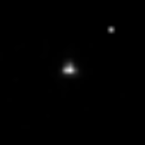
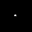

#Optimal Aperture Calculation
####Parallelized Analysis of the Spitzer Telescope Dataset
Team: Hannah Diamond-Lowe, Zakir Gowani

The _Spitzer Space Telescope_ has recently been used to observe exoplanets. Datasets from _Spitzer_ provide 32x32 images of stars over a time period comparable to the orbit of an exoplanet around the star. The time-dependence of brightness describes various qualities of the exoplanet. However, light noise is a problem. Current methods rely on manual aperture adjustment to throw out unwanted background noise in the data. Our project is to automate this process and extend the accuracy by accounting for a finer degree of time variation. 

 --- 

Our immediate purpose is to find intelligent, time-dependent aperture sizes for stellar observations using _Spitzer_, which reduce noise but conserve valuable star-and-planet system information. The ultimate goal is to to produce the optimal aperture size for a considerable number of stars (each star has 4x ~5 GB worth of images, when accounting for the four detectors on _Spitzer_). As a check, we can compare models existing in the literature to a model output based on our aperture calculations. 

#####Instructions for Prototype Use
The primary script for aperture calculation can be run using

    python aperture_calculator.py

The goal of this prototype script is to demonstrate our aperture calculation algorithm on a single image. This algorithm calculates signal-to-noise ratios for a set of aperture radii, incurring an exponential penalty with each increase in aperture size. The weighting function is an which imitates a Gaussian point spread distribution. 
The current data set is contained in a single file located in the folder titled prototype_data, titled "SPITZER_I1_41629440_0000_0000_1_bcd.fits". The Astropy library is used to convert the fits image into a numpy array of flux values. We then process this table using an assortment of disk and annulus masking functions, all of which rely on the [Bresenham circle algorithm](http://en.wikipedia.org/wiki/Midpoint_circle_algorithm) to draw circles on grids. 

Packages used will include:
* [Astropy](https://astropy.readthedocs.org/en/stable/overview.html), a popular astronomy library for Python which deals with .fits files, the standard data format for our Spitzer star observation data.
* [SAOImage DS9](http://ds9.si.edu/site/Home.html), an Astronomical Data Visualization Application. Allows for direct viewing of the individual frames in .fits files
* [Python Imaging Library](http://www.pythonware.com/products/pil/) for image file I/O and resizing
* [MPI for Python](http://mpi4py.scipy.org/docs/usrman/), a Python library for message passing and parallelization.

#####Timeline:
* By May 6: Prototype will demonstrate aperture calculation algorithm on a single frame for a single star
* By May 18: Expand algorithm's operation to consider time variation over frames
* By May 25: Revise algorithm to be parallelizable in an MPI framework
* By June 3: Final implementation of project which compares models, accompanied by visualizations and a writeup
